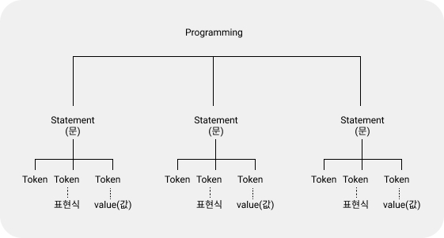

# 값, 식, 문

## Value

_**value**_**\(값\)**은 expression\(식\)이 evaluate\(평가\)되어 생성된 결과입니다. 모든 값은 데이터 타입을 가집니다. 값은 데이터 타입에 따라 해석이 다르게 됩니다.

### 리터럴

literal은 사람이 이해할 수 있는 문자 또는 약속된 기호를 사용해 값을 생성하는 notation\(표기법\). 자바스크립트는 runtime에 리터럴을 평가하여 값으로 생성합니다.

## Expression

Expression은 value로 평가될 수 있는 statement\(문\)입니다. 즉, 표현식이 평가되면 새로운 값을 생성하거나 기존 값을 참조합니다.

## Statement

프로그램을 구성하는 기본 단위이자 최소 실행 단위입니다. 문의 집합이 프로그램이고, 문을 작성하고 순서에 맞게 나열하는 것이 프로그래밍입니다.

